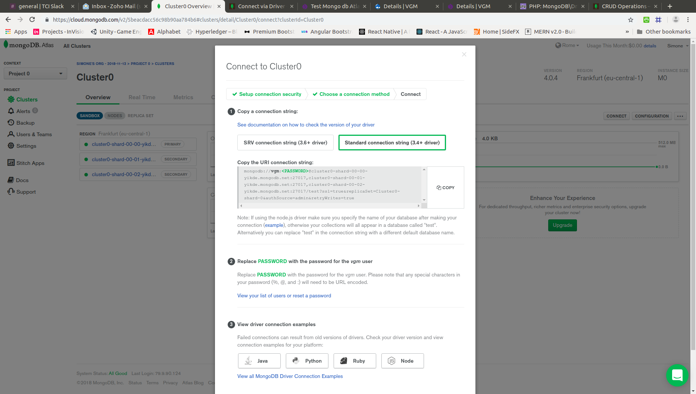

# MongoDB Atlas
## Mongo db php
The currently maintained driver is the [mongodb](https://pecl.php.net/package/mongodb) extension available from PECL.
This driver can be used stand-alone, although it is very bare-bones.

You should consider using the driver with the complimentary [PHP library](https://github.com/mongodb/mongo-php-library), which implements a more full-featured API on top of the bare-bones driver.

Further information on this architecture may be found in the [PHP.net documentation](http://php.net/manual/en/mongodb.overview.php).

### Insall PHP driver mongodb extension

- **From repositories**

  Ho installato il pacchetto
  ```
  sudo apt-get install php-mongodb
  ```

  ed abilitato con
  ```
  sudo phpenmod mongodb
  ```

  Questo pacchetto fornisce la base bare-bones con le classi base
  ```
  $manager = new MongoDB\Driver\Manager("mongodb://localhost:27017");
  ```
  ma non riesce ad effettuare l'autenticazione in quanto la versione è troppo vecchia.

- **From PECL extensions/modules**

  Come da documentazione installiamo l'estensione PECL
  Installato
  ```
  sudo apt-get install php7.0-dev
  ```
  Installato
  ```
  sudo apt-get install php-pear
  ```
  Installato mongodb PECL extesion/module
  ```
  sudo pecl install mongodb
  ```
  L'extension va a sovrascrivere quella relativa al pacchetto fornito da repository
  ```
  Installing '/usr/lib/php/20151012/mongodb.so'
  ```

  Una volta installato il driver bisogna abilitarlo
  ```
  sudo phpenmod mongodb
  ```
  E' possibile verificare se il modulo è abilitato e la versione con `phpinfo();`

### Install PHP library
La libreria PHP può essere installata utilizzando composer.

Per lavorare con composer in drupal 7 utilizaimo il modulo [Composer Manager](https://www.drupal.org/project/composer_manager) che serve per gestire multipli composer.json sparsi fra i vari moduli

Dopo aver installato il modulo viene generata una directory `/sites/default/files/composer` con un file composer.json di default lanciamo
`/sites/default/files/composer$ composer install`

Poi installiamo la libreria
```
ilpise@amytis:/var/www/html/vgm/sites/default/files/composer$ composer require mongodb/mongodb
Using version ^1.4 for mongodb/mongodb
./composer.json has been updated
Loading composer repositories with package information
Updating dependencies (including require-dev)
Package operations: 1 install, 0 updates, 0 removals
  - Installing mongodb/mongodb (1.4.2): Downloading (100%)         
Writing lock file
Generating autoload file
```

Nel modulo vgm aggiungiamo un file composer.json
```
{
    "name": "vgm",
    "description": "Mongodb php library",
    "require": {
        "mongodb/mongodb": "^1.4"
    }
}
```
che specifica che la libreria mongo db è richiesta dal modulo vgm

la libreria/librerie vere e proprie vengono installate nella directory `sites/all/vendor`

- Per ottenere la url cui connettersi



## Mogo client
Per collegarsi a mongodb atlas da command line è necessario utilizzare mongoclient 4.0.4 che va scaricato

~/Mindly/vgm/mongodb-linux-x86_64-ubuntu1604-4.0.4/bin$ ./mongo "mongodb://cluster0-shard-00-00-yikde.mongodb.net:27017,cluster0-shard-00-01-yikde.mongodb.net:27017,cluster0-shard-00-02-yikde.mongodb.net:27017/test?replicaSet=Cluster0-shard-0" --ssl --authenticationDatabase admin --username vgm --password 1qazxsw2
MongoDB shell version v4.0.4
connecting to: mongodb://cluster0-shard-00-00-yikde.mongodb.net:27017,cluster0-shard-00-01-yikde.mongodb.net:27017,cluster0-shard-00-02-yikde.mongodb.net:27017/test?replicaSet=Cluster0-shard-0
2018-11-13T18:38:27.290+0100 I NETWORK  [js] Starting new replica set monitor for Cluster0-shard-0/cluster0-shard-00-00-yikde.mongodb.net:27017,cluster0-shard-00-01-yikde.mongodb.net:27017,cluster0-shard-00-02-yikde.mongodb.net:27017
2018-11-13T18:38:27.526+0100 I NETWORK  [js] Successfully connected to cluster0-shard-00-00-yikde.mongodb.net:27017 (1 connections now open to cluster0-shard-00-00-yikde.mongodb.net:27017 with a 5 second timeout)
2018-11-13T18:38:27.526+0100 I NETWORK  [ReplicaSetMonitor-TaskExecutor] Successfully connected to cluster0-shard-00-01-yikde.mongodb.net:27017 (1 connections now open to cluster0-shard-00-01-yikde.mongodb.net:27017 with a 5 second timeout)
Implicit session: session { "id" : UUID("7c1f9ea9-61b5-4ba9-ad64-b23278ecd1f7") }
2018-11-13T18:38:27.736+0100 I NETWORK  [ReplicaSetMonitor-TaskExecutor] Successfully connected to cluster0-shard-00-02-yikde.mongodb.net:27017 (1 connections now open to cluster0-shard-00-02-yikde.mongodb.net:27017 with a 5 second timeout)
MongoDB server version: 3.6.8
WARNING: shell and server versions do not match
Error while trying to show server startup warnings: user is not allowed to do action [getLog] on [admin.]
MongoDB Enterprise Cluster0-shard-0:PRIMARY> show databases;
admin  0.000GB
local  2.783GB
test   0.000GB
MongoDB Enterprise Cluster0-shard-0:PRIMARY> exit
bye

# TODO
vedi https://app.moqups.com/gianfranco.elia@gmail.com/7XIcbnlwpm/viewm

Mobile/Vettore
Web app su chrome

Vettore/Mobile
deve inserire
1. booking number
2. seal number
3. container number

inseriti i dati -> Invio VGM

Back office
Inserimento dati logo Azienda

 - Assegnazione vettore/truck
 - Assegnazione vettore/gruppoditruck -> possibilità di scegliere il truck da interfaccia vettore

Back office - Fig CRM di mokups
è una strisciata del vgm inviato

2 tipologie di Contacts **Content types**
1. _Shipper_ - fields sono in Fig CRM
2. _Persone autorizzate_ - fields sono in Fig CRM
3. Ship
  - User - di tipo vettore/authuser base collegato
  - Data -
  - Luogo - prendere il dato da kimax dati mongodb
  - Shipper - dal content type _Shipper_
  - Booking number - inserite dal vettore
  - Seal number - inserite dal vettore
  - Container number - inserite dal vettore
  - Peso VGM - prendere il dato da kimax dati mongodb
  - Metodo (option 1/2) default 1
  - Persona autorizatta - dal content type  _Persone autorizzate_

  - Genera VGM - pulsante per generare Vgm
